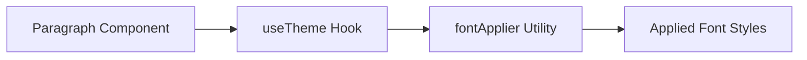

## Overview

The Paragraph component is a basic UI component used for rendering paragraphs of text. It supports theming and font styling.

## Usage

```tsx
import Paragraph from '@/components/ui/basic/paragraph';

const App = () => {
  return (
    <Paragraph>
      This is a sample paragraph.
    </Paragraph>
  );
};
```

## Props

| Prop | Type | Description |
| --- | --- | --- |
| children | React.ReactNode | The content of the paragraph. |
| className | string | Additional CSS classes for the paragraph. |
| theme | string | The theme to apply (e.g., 'modern'). |

## ThemeProvider Integration

To use the Paragraph component with theme support, ensure that your application is wrapped with the `ThemeProvider` component from `@/contexts/ui-theme-context`.

```tsx
import { ThemeProvider } from '@/contexts/ui-theme-context';

const App = () => {
  return (
    <ThemeProvider>
      <Paragraph>
        This is a sample paragraph.
      </Paragraph>
    </ThemeProvider>
  );
};
```

## Code Logic

The Paragraph component uses the `useTheme` hook to retrieve the current theme and applies the corresponding font styles using the `fontApplier` utility.



## Changes

The Paragraph component has been updated to use the `use client` directive and to support server-side rendering.